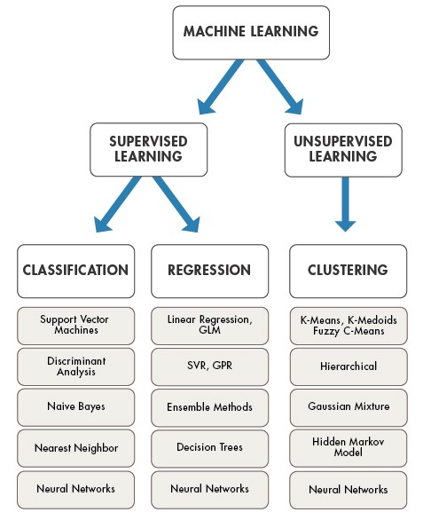

# Study Plan

The study plan

## Data Science
- Advanced Linear Algebra
- Advanced Statistics
- Regression
- Classification
- Predictive Models
  
## Languages
- R (data science, data analysis)
- Python (general)
- Java (general) / Scala
- C# (Microsoft)
- Swift (iOS, macOS)
- Kotlin (Android)

## Machine Learning

### Traditional Methods
  - Supervised
    -  Regression
       - Linear Regression
       - GLM
       - SVR
       - GPR
       - Ensemble Methods
       - Decision Trees  
    -  Classification 
       - SVM
       - Discriminant Analysis
       - Naive Bayes
       - Nearest Neighbor  
  - Unsupervised
    - Clustering
      - K-Means
      - K-Medoids
      - Fuzzy C-Means
      - Hierarchical
      - Gaussian Mixture
      - Hidden Markov Model 

### Neural Networks

[Image source](https://towardsdatascience.com/the-mostly-complete-chart-of-neural-networks-explained-3fb6f2367464)

- Perceptron
- Feed Forward (FF)
- Radial Basis Function (RBF)
- Deep Feed Forward (DFF)
- Recurrent Neural Network (RNN)
- Long / Short Term Memory (LSTM)
- Gated Recurrent Unit (GRU)
- Auto Encoder (AE)
- Variational Auto Encoder (VAE)
- Denoising Auto Encoder (DAE)
- Sparse Auto Encoder (SAE)
- Markov Chain (MC)
- Hopfield Network (HN)
- Boltzmann Machine (BM)
- Restricted Boltzmann Machine (RBM)
- Deep Belief Network (DBN)
- Deep Convolutional Network (DCN)
- Deconvolutional Network (DN)
- Deep Convolutional Inverse Graphics Network (DCIGN)
- Generative Adversarial Network (GAN)
- Liquid State Machine (LSM)
- Extreme Learning Machine (ELM)
- Echo State Network (ESN)
- Deep Residual Network (DRN)
- Kohonen Network (KN)
- Support Vector Machine (SVM)
- Neural Turing Machine (NTM)